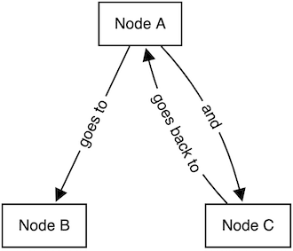

# [Flowchart Fun](https://flowchart.fun/)

A webapp for generating flowcharts from text @ https://flowchart.fun


## Summary

Flowchart Fun is a webapp for generating flowcharts from text built with React and [cytoscape.js](https://github.com/cytoscape/cytoscape.js).

### Example

```
Node A
  goes to: Node B
  and: Node C
    goes back to: (Node A)
```



## Development

### Prerequisites

Premium features including auth, hosted charts and permalinks are built using integrations with [Vercel Functions](https://vercel.com/docs/concepts/functions/introduction), [Supabase](https://supabase.io/), [Stripe](https://stripe.com/) and [Sendgrid](https://sendgrid.com/) so you will need accounts with each of those services.

### Getting Started

1. Clone the repository
1. Copy `.env.example` to `.env` and add env variables
1. `pnpm install` and `vercel dev`

#### To run with login features:

`vercel dev`

#### To run without login features:

`pnpm dev`

### Translations

Flowchart Fun uses [Lingui](https://lingui.js.org/) for translations. These are the steps to follow:

1. All text that should be translated should be wrapped in `<Trans>` component or `` t` `` template string. These are imported from `@lingui/macro`.
1. Strings are extracted with `pnpm -F app extract`. Then translations can be added to `.po` files in `/app/src/locales/[language]/messages.po`
1. When all translations are added, run `pnpm -F app compile`.

### Tests

#### Unit Tests

- You can run jest tests with `pnpm test`

#### E2E Tests

We use playwright for e2e tests. Playwright is always installed on the system so you need to globally install it at the correct version: `1.27.1`. You can find the version in the github e2e workflow file.

1. Make sure playwright version 1.27.1 is installed globally
1. Start the app with `vercel dev` and then run `pnpm -F app e2e` (or for `pnpm -F app e2e:debug` debugging)

### Analyze the Bundle

`pnpm -F app build && pnpm -F app analyze`

## Release

1. Branch from `dev` to develop a feature
1. **Squash** and merge the feature branch into `dev`
1. (Repeat until happy)
1. Update version in /app/package.json and commit directly to `dev`. Push.
1. Open PR from `dev` to `main`
1. Merge (**do not squash!**) PR and a new github release will be created

## Contributing

We always welcome contributions! Before opening a pull request with a new feature, consider opening an issue or discussion to gauge support and/or confirm your implementation.
